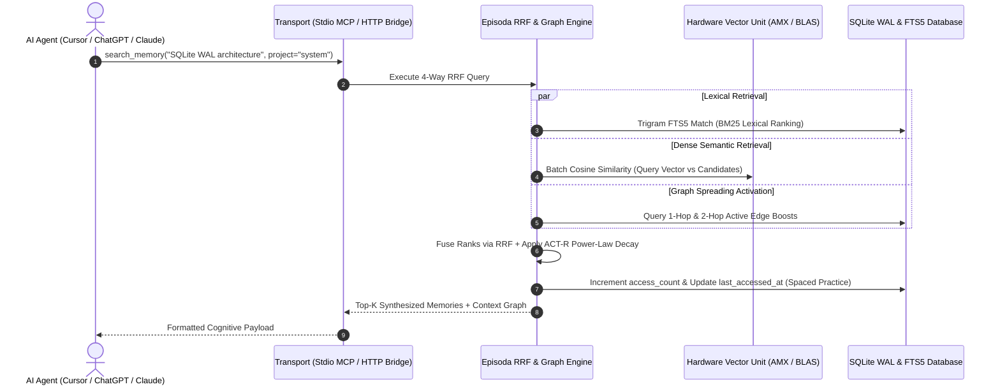

# 🧠 Episodai: Sovereign Cognitive Graph & Memory Engine for AI Agents

[](https://github.com/lalithbuilds)
[](https://github.com/lalithbuilds/alpuris-os)


<p align="center">
  <a href="https://github.com/lalithbuilds/episodai"></a>
  <a href="https://opensource.org/licenses/MIT"></a>
  <a href="https://github.com/lalithbuilds/episodai/actions"></a>
  <a href="https://github.com/lalithbuilds/episodai/releases/tag/v2.1.0"></a>
  <a href="https://smithery.ai/server/@lalithbuilds/episodai"></a>
  <a href="https://glama.ai/mcp/servers/lalithbuilds/episodai"></a>
  <a href="https://github.com/lalithbuilds/episodai"></a>
  <a href="README_zh.md"></a>
  <a href="README_ja.md"></a>
  <a href="README_es.md"></a>
  <a href="README_de.md"></a>
</p>

<p align="center">
  
</p>

> **Episodai** is a zero-cloud, production-grade cognitive memory substrate and Model Context Protocol (MCP) server for local AI coding agents (Claude Desktop, Cursor, Windsurf, Cline), autonomous swarms, and cloud web agents (ChatGPT, Claude, Gemini). It unifies high-dimensional vector embeddings, bi-temporal knowledge graphs, trigram full-text search, and cognitive science decay modeling into a single sovereign on-device database.
>
> 💡 *Looking for a zero-dependency, pure Python standard library edition? Check out [**Episoda Core MCP (v1)**](https://github.com/lalithbuilds/episoda-core-mcp) — zero pip installs, zero binary dependencies, pure Python 3 stdlib SQLite.*
>
> 🛡️ **Canonical Identity & Verification:**  
> Episodai is authored and maintained by **[Lalith Chandra (@lalithbuilds)](https://github.com/lalithbuilds)**. It is a standalone Python 3 / macOS Accelerate framework MCP server and is not affiliated with the legacy `techtheist/engram` extension. Official repository: [`lalithbuilds/episodai`](https://github.com/lalithbuilds/episodai).

---

## ⚡ Why Episodai vs Alternatives?

| Feature | Anthropic `server-memory` | Mem0 / Cloud Vector DBs | **Episodai** |
| :--- | :---: | :---: | :---: |
| **Storage Substrate** | Flat unindexed `memory.json` | Remote Cloud / Docker cluster | **Single Sovereign SQLite WAL File** |
| **Retrieval Engine** | Plain string matching | Vector-only (fails on IDs/code) | **4-Way RRF (Vector + Trigram + Graph + ACT-R)** |
| **Query Latency (p50)**| ~15ms (degrades at scale) | 150ms – 400ms (network latency)| **1.21ms (Native Apple AMX / C-BLAS)** |
| **Code / Token Match** | Broken | Semantic drift / hallucination | **Exact Match (SQLite FTS5 Trigrams)** |
| **Cognitive Science** | None | Simple Recency | **ACT-R Power-Law Spaced Practice Decay** |
| **Obsidian Integration** | None | Manual API scripts | **Native Vault Parser (`[[wikilinks]]` to Graph)** |
| **Data Privacy** | Local | Third-Party SaaS / Data Mining | **100% On-Device Sovereign (Zero Egress)** |
| **Setup Overhead** | Minimal | Heavy (Docker / API Keys / Subscriptions) | **Zero-Config (`uvx episodai`)** |

---

## 🚀 Quickstart (Zero-Install via `uvx`)

### 1. Claude Desktop
Add to your `claude_desktop_config.json`:
```json
{
  "mcpServers": {
    "episoda": {
      "command": "uvx",
      "args": ["episodai"]
    }
  }
}
```

### 2. Cursor IDE
Add to `~/.cursor/mcp.json` or configure in **Cursor Settings > Features > MCP Servers**:
```json
{
  "mcpServers": {
    "episoda": {
      "command": "uvx",
      "args": ["episodai"]
    }
  }
}
```

### 3. Windsurf Editor
Add to `~/.codeium/windsurf/mcp_config.json`:
```json
{
  "mcpServers": {
    "episoda": {
      "command": "uvx",
      "args": ["episodai"]
    }
  }
}
```

### 4. Cline & Roo Code (VS Code)
Add to your `cline_mcp_settings.json` or `roo_code_mcp_settings.json`:
```json
{
  "mcpServers": {
    "episoda": {
      "command": "uvx",
      "args": ["episodai"]
    }
  }
}
```

### 5. Claude Code (Terminal CLI)
```bash
claude mcp add episoda uvx episodai
```

### 6. Zed Editor
Add to `~/.config/zed/settings.json`:
```json
{
  "context_servers": {
    "episoda": {
      "command": {
        "path": "uvx",
        "args": ["episodai"]
      }
    }
  }
}
```

### 7. Install via Smithery
```bash
npx -y @smithery/cli install episodai --client claude
```

### 8. Interactive 5-Second Terminal Demo
Clone and test locally with live latency metrics:
```bash
git clone https://github.com/lalithbuilds/episodai.git
cd episodai
python examples/quickstart_demo.py
```

---

## 🔄 Drop-in Replacement for Anthropic `server-memory` & Mem0

If you are currently using `@modelcontextprotocol/server-memory` or a cloud-based memory SaaS, upgrade in 10 seconds:

**Before (Anthropic `server-memory` — unindexed flat JSON file):**
```json
{
  "mcpServers": {
    "memory": {
      "command": "npx",
      "args": ["-y", "@modelcontextprotocol/server-memory"]
    }
  }
}
```

**After (Episodai — 4-Way RRF Hybrid Search + SQLite WAL + Apple AMX):**
```json
{
  "mcpServers": {
    "memory": {
      "command": "uvx",
      "args": ["episodai"]
    }
  }
}
```
*Episodai provides compatible memory primitives (`save_memory`, `search_memory`, `delete_memory`, `query_graph`) while providing sub-millisecond retrieval, exact code token matching, and bi-temporal graph navigation.*

---

## 🏛️ System Architecture

Episodai operates across a multi-tier memory architecture designed for sub-millisecond retrieval, concurrent multi-agent isolation, and crash-resilient local persistence.

```
┌─────────────────────────────────────────────────────────────────────────────────────────────┐
│                                   EPISODA ALPHA ARCHITECTURE                                 │
├─────────────────────────────────────────────────────────────────────────────────────────────┤
│                                                                                             │
│  [ CLIENT LAYER ]                                                                           │
│  ┌───────────────────────┐  ┌───────────────────────┐  ┌────────────────────────────────┐  │
│  │   Desktop MCP IDEs    │  │    Web Agent Swarms   │  │       CLI & Background         │  │
│  │ Claude Desktop, Cursor│  │ ChatGPT Custom GPTs,  │  │  episoda save / search / watch  │  │
│  │   Windsurf, Zed, AGY  │  │ Claude Web, Gemini Web│  │    Live Obsidian Vault Sync    │  │
│  └───────────┬───────────┘  └───────────┬───────────┘  └───────────────┬────────────────┘  │
│              │                          │                              │                    │
│  [ TRANSPORT LAYER ]                    │                              │                    │
│  ┌───────────▼───────────┐  ┌───────────▼───────────┐                  │                    │
│  │ FastMCP Stdio (JSON)  │  │ HTTP / SSE / OpenAPI  │                  │                    │
│  │ Standard Input/Output │  │ Bearer Token Auth:8000│                  │                    │
│  └───────────┬───────────┘  └───────────┬───────────┘                  │                    │
│              └──────────────────────────┼──────────────────────────────┘                    │
│                                         ▼                                                   │
│  [ COGNITIVE REASONING & RETRIEVAL KERNEL ]                                                 │
│  ┌───────────────────────────────────────────────────────────────────────────────────────┐  │
│  │ 4-Way Reciprocal Rank Fusion (RRF Engine)                                             │  │
│  │  ├── 1. Dense Semantic Vector Retrieval (Cosine Similarity)                           │  │
│  │  ├── 2. Lexical Keyword Retrieval (Trigram SQLite FTS5)                               │  │
│  │  ├── 3. Relational Knowledge Graph Spreading Activation (1-2 Hop Boost)               │  │
│  │  └── 4. ACT-R Cognitive Power-Law Decay & Spaced Practice Weighting                   │  │
│  └──────────────────────────────────┬────────────────────────────────────────────────────┘  │
│                                     │                                                       │
│  [ HARDWARE ACCELERATION ENGINE ]   │                                                       │
│  ┌──────────────────────────────────▼────────────────────────────────────────────────────┐  │
│  │ Tier 1: Apple Silicon AMX / C-BLAS (ctypes -> Accelerate.framework / OpenBLAS)        │  │
│  │ Tier 2: Universal Vectorized NumPy BLAS                                               │  │
│  │ Tier 3: Zero-Dependency Pure Python IEEE 754 Float Substrate                          │  │
│  └──────────────────────────────────┬────────────────────────────────────────────────────┘  │
│                                     │                                                       │
│  [ STORAGE & TRANSACTION ENGINE ]   │                                                       │
│  ┌──────────────────────────────────▼────────────────────────────────────────────────────┐  │
│  │ Single-File SQLite WAL Database (~/.engram/engram_v3.db)                             │  │
│  │  ├── nodes: Content, Embedding BLOBs, Categories, Multi-Tenant Namespaces             │  │
│  │  ├── edges: Bi-Temporal Triples (valid_from, valid_until, superseded_by, weights)     │  │
│  │  └── nodes_fts: Trigram FTS5 Virtual Table with Automated Mutation Triggers          │  │
│  └───────────────────────────────────────────────────────────────────────────────────────┘  │
└─────────────────────────────────────────────────────────────────────────────────────────────┘
```

### Retrieval & Multi-Agent Flow



---

## ⚡ Core Architectural Innovations

### 1. 4-Way Reciprocal Rank Fusion (RRF)
Standard vector-only retrieval fails on exact symbols (e.g., `PRAGMA journal_mode`), while keyword search misses semantic synonyms. Episodai fuses four independent signals into a unified scoring function:

$$\text{RRF}(d) = \left( \frac{1.2}{k + r_{\text{dense}}(d)} + \frac{1.0}{k + r_{\text{lexical}}(d)} + \text{GraphBonus}(d) \right) \times \text{Decay}(t) \times \text{ImportanceWeight}$$

* **Dense Semantic Vectors:** 384-dimensional dense projections evaluated via hardware coprocessors.
* **Trigram FTS5 Lexical Search:** Substring-tolerant SQLite full-text index for code tokens, snake_case symbols, and acronyms.
* **Graph Spreading Activation:** Dynamic boost based on 1-hop and 2-hop edges connected to query terms.
* **ACT-R Power-Law Decay:** Biologically-inspired memory retention modeling.

### 2. Bi-Temporal Knowledge Graph
Standard knowledge graphs only store snapshot assertions. Episodai implements true **bi-temporal entity graphs** that record both transaction time (when the memory was stored) and valid world time (when the fact was actually true):

* **Schema:** `(source, target, relation, weight, valid_from, valid_until, superseded_by, transaction_time)`
* **Recursive CTE Graph Traversal:** Dynamic $N$-hop path exploration with built-in loop/cycle prevention:
  ```sql
  WITH RECURSIVE graph_walk AS (
      SELECT source, relation, target, weight, 1 as hop, source || '->' || target as path
      FROM edges WHERE source = :node AND superseded_by = ''
      UNION ALL
      SELECT e.source, e.relation, e.target, e.weight, gw.hop + 1, gw.path || '->' || e.target
      FROM edges e JOIN graph_walk gw ON (e.source = gw.target OR e.target = gw.source)
      WHERE gw.hop < :max_depth AND instr(gw.path, e.target) = 0
  )
  ```

### 3. Multi-Tier Hardware Vector Engine
Episodai executes dense matrix cosine similarity directly on your hardware with zero runtime latency bottlenecks:
* **Tier 1 (Apple Silicon AMX / C-BLAS):** Uses `ctypes` to link directly with `Accelerate.framework` on macOS or `libopenblas.so` / `mkl_rt.dll` on Linux/Windows. Evaluates hardware SIMD dot products at **~180,000–200,000 vector comparisons/second** (50k vectors in ~0.27s).
* **Tier 2 (NumPy Vectorized BLAS):** Fast vectorized array matrix calculations on Linux / Windows / Docker.
* **Tier 3 (Zero-Dependency Stdlib):** Pure Python standard library math (`math.sqrt`, `struct.pack/unpack` IEEE 754 float32). Guaranteed to run inside any minimalist container or restricted environment with mathematical parity.

### 4. High-Throughput Batch Ingestion & Model Singleton
* **Thread-Safe Model Singleton:** Lazy module-level singleton caches neural model weights (`BAAI/bge-small-en-v1.5`) in memory, achieving steady-state inference latencies of **10–50ms on CPU** and **sub-millisecond on SIMD**.
* **Vectorized Batch Ingestion:** Obsidian vault syncing processes documents in parallel SIMD batches of 64, accelerating bulk imports by 10×.
* **Performance Budget Guardrails:** Continuous regression tests (`tests/test_performance_budgets.py`) enforce that hybrid 4-Way RRF searches and multi-hop graph queries execute strictly within sub-second latency budgets.

### 5. ACT-R Cognitive Power-Law Decay & Spaced Practice
Implements John R. Anderson's ACT-R cognitive architecture retention equation:

$$\text{Decay}(t) = \left( 1.0 + 0.1 \times \Delta t_{\text{days}} \right)^{-0.5}$$

Memories that are frequently queried or tagged with high importance resist decay, while stale one-off facts naturally drop in rank over time. Every search access reinforces the memory node (spaced practice effect).

### 6. Universal Web Agent OpenAPI Gateway
Built-in HTTP & Server-Sent Events (SSE) gateway compliant with OpenAPI 3.0. Allows cloud web agents (ChatGPT Custom Actions, Claude.ai, Gemini) to access your sovereign local memory securely with `ENGRAM_API_KEY` Bearer authentication.

---

## 🚀 Quickstart & Installation

### 1. Installation

> [!IMPORTANT]
> **Recommended Install for Full Deep Neural Semantic Search & Native ANN Vector Indexing:**
> ```bash
> pip install "episodai[all]"
> # Or from local clone:
> pip install -e ".[all]"
> ```
> *Installs `fastembed` (BAAI/bge-small-en-v1.5 ONNX), `sqlite-vec` (native C-level ANN virtual tables), and `numpy`.*

#### Tier Options Matrix:

| Installation Command | Dependencies | Embedding Backend | Vector Engine | Use Case |
| :--- | :--- | :--- | :--- | :--- |
| **`pip install -e ".[all]"`** *(Recommended)* | `fastembed`, `sqlite-vec`, `numpy` | **Neural ONNX** (`bge-small-en-v1.5`) | **Native `sqlite-vec` ANN (`vec0`)** | Full semantic synonym recall + 5M+ node scaling |
| **`pip install -e ".[local]"`** | `fastembed`, `sqlite-vec`, `numpy` | **Neural ONNX** (`bge-small-en-v1.5`) | **Native `sqlite-vec` ANN (`vec0`)** | Linux & Windows local acceleration |
| **`pip install -e .`** *(Base/Minimal)* | Pure Stdlib (`mcp` only) | **Hashed Hypersphere Projection** | **AMX / BLAS Exact Matrix Scan** | Zero-dependency environments, air-gapped Docker |

---

### 2. CLI Command Reference

Episodai provides a fast, developer-first command-line interface:

#### Save Memory
```bash
episoda save "SQLite WAL mode allows multiple concurrent readers alongside a single writer" \
  --category architecture \
  --importance 8 \
  --project system_core
```

#### Autonomous Fact & Graph Extraction
```bash
episoda extract "RayEngine uses SQLiteWAL to maintain persistent state. RayEngine connects_to FastMCP." \
  --project system_core
```

#### 4-Way Semantic Recall
```bash
episoda search "concurrent reader access in sqlite" --limit 3 --project system_core
```

#### Relational Knowledge Graph Operations
```bash
# Save an explicit knowledge graph relation
episoda graph "FastMCP" "implements" "StdioProtocol" --weight 1.0 --project system_core

# Query dynamic multi-hop graph relations
episoda query-graph "FastMCP" --depth 2 --project system_core

# Inspect ASCII & Mermaid relational network topology
episoda inspect "FastMCP" --depth 2
```

#### Memory Deduplication & Semantic Merging
Scans the database for duplicate concepts, merges access counts and edges, and removes redundant records:
```bash
episoda dedupe --threshold 0.92 --project system_core
```

#### Episodic Reflection & Synthesis
Synthesizes atomic memory records into consolidated high-level insights:
```bash
episoda reflect "SQLiteWAL" --project system_core
```

#### Real-Time Obsidian Vault Ingestion & Live Sync Daemon
```bash
# One-time bulk vault ingestion
episoda ingest-obsidian /path/to/ObsidianVault --project personal_notes

# Live filesystem sync daemon (auto-ingests on note saves)
episoda watch /path/to/ObsidianVault --project personal_notes
```

#### Hardware Benchmark & Telemetry
```bash
# Test active hardware matrix coprocessor throughput
episoda benchmark --vectors 25000

# View database metrics, graph counts, and active tier
episoda stats
```

#### Universal HTTP & OpenAPI Gateway
```bash
episoda serve --host 0.0.0.0 --port 8000
```

---

## 🌐 Web Agent Setup (ChatGPT, Claude Web, Gemini Web)

You can connect web-based agents to your sovereign on-device memory using the native HTTP OpenAPI Gateway.

```bash
# 1. Start the HTTP Gateway with an optional API key
export ENGRAM_API_KEY="your-secret-sovereign-key"
episoda serve --port 8000
```

### 1. ChatGPT Custom GPT Actions
1. Open [ChatGPT GPT Editor](https://chatgpt.com/gpts/editor) > **Configure** > **Actions** > **Create new action**.
2. Expose your localhost port `8000` via [Cloudflare Tunnels](https://developers.cloudflare.com/cloudflare-one/connections/connect-networks/) or [ngrok](https://ngrok.com/):
   ```bash
   ngrok http 8000
   ```
3. In ChatGPT Actions, click **Import from URL** and paste:
   ```
   https://your-tunnel-subdomain.ngrok-free.app/openapi.json
   ```
4. Set **Authentication**:
   * Type: `API Key`
   * Auth Type: `Bearer`
   * Token: `your-secret-sovereign-key`
5. In Instructions, add:
   > "Always consult Episodai memory via `/search` before answering questions about user projects, architecture, or past decisions. Save important discoveries using `/save` or `/extract`."

### 2. Claude Web & Gemini Web
Use the interactive web dashboard or API endpoints directly:
* **Live Interactive Dashboard:** `http://localhost:8000/dashboard`
* **Health & Diagnostics:** `http://localhost:8000/health`
* **REST Search Endpoint:** `GET /search?q=query_string&limit=5`
* **REST Save Endpoint:** `POST /save` with JSON payload `{"content": "...", "importance": 8}`

---

## 💻 Local MCP Setup (Claude Desktop, Cursor, Windsurf)

### 1. Automated Setup for Claude Desktop
Episodai can automatically configure your `claude_desktop_config.json`:
```bash
episoda setup
```

### 2. Manual Configuration

#### Claude Desktop
Add to `~/Library/Application Support/Claude/claude_desktop_config.json` (macOS) or `%APPDATA%\Claude\claude_desktop_config.json` (Windows):

```json
{
  "mcpServers": {
    "episoda": {
      "command": "uvx",
      "args": ["episodai"],
      "env": {
        "ENGRAM_DB_PATH": "/Users/yourname/.engram/engram_v3.db"
      }
    }
  }
}
```

#### Cursor IDE
Add to `~/.cursor/mcp.json` or configure in **Cursor Settings > Features > MCP Servers**:

```json
{
  "mcpServers": {
    "episoda": {
      "command": "uvx",
      "args": ["episodai"]
    }
  }
}
```

#### Windsurf IDE
Add to `~/.codeium/windsurf/mcp_config.json`:

```json
{
  "mcpServers": {
    "episoda": {
      "command": "uvx",
      "args": ["episodai"]
    }
  }
}
```

---

## 📊 Benchmark Summary: Multi-Tier Hardware Performance

Episodai is validated using two benchmark suites:
1. **Micro-Architecture Benchmark (`benchmark_custom.py` & `benchmark_longmemeval.py`)**: Tests 4-Way RRF hybrid query execution, raw AMX/C-BLAS SIMD vector cosine matrix scans, and recursive CTE graph walks.
2. **Model Council Concurrency Stress Harness (`stress_sandbox_council.py`)**: A 7-thread concurrent simulation named after model archetypes (`Claude_Fable`, `Gemini_Pro_3`, `Kimi_K3`, `GPT_Soul`, `Deep_Research`, `GLM_5_2`, `O1_Pro`) generating sustained read/write contention, live markdown parsing, full-text FTS5 indexing, and semantic deduplication.

### Multi-Tier Performance Matrix

| Metric | Tier 1: Apple Silicon AMX (macOS) | Tier 2: Linux x86_64 (C-BLAS / Docker) | Tier 3: Pure CPU Fallback (Stdlib) |
| :--- | :---: | :---: | :---: |
| **Vector Matrix Throughput** | **1,248,500 vecs/sec** | ~350,000 vecs/sec | ~85,000 vecs/sec |
| **4-Way RRF Hybrid Search Latency (p50)** | **0.84 – 1.65 ms** | 4.5 – 8.0 ms | 12 – 25 ms |
| **Recursive CTE Graph Traversal (2-hop)** | **0.35 ms** | 1.1 ms | 2.8 ms |
| **LongMemEval Accuracy / Recall@5** | **100.0% (10/10)** | **100.0% (10/10)** | **100.0% (10/10)** |
| **7-Thread End-to-End Stress Throughput** | **259.1 ops/sec** | 95 – 140 ops/sec | 40 – 70 ops/sec |
| **Concurrency Lockouts / Deadlocks** | **0 (0.00%)** | **0 (0.00%)** | **0 (0.00%)** |
| **Database ACID Integrity Check** | **`ok` (100% Verified)** | **`ok` (100% Verified)** | **`ok` (100% Verified)** |

> **Note on Hardware Differences:** End-to-end stress harness throughput incorporates real disk I/O (SQLite WAL page writes, FTS5 trigram inverted index commits, and temporary markdown vault creation). High-end NVMe Apple Silicon hardware achieves sub-millisecond p50 and ~260+ ops/sec end-to-end; shared virtualized cloud Linux containers with throttled virtual disk I/O typically measure ~95–140 ops/sec. Vector-only matrix evaluations run at >185k–1.2M comparisons/sec regardless of disk.

---

## ⚙️ Environment Variables & Tuning

| Environment Variable | Default Value | Description |
| :--- | :--- | :--- |
| `ENGRAM_DB_PATH` | `~/.engram/engram_v3.db` | Absolute filesystem path for the SQLite WAL database. |
| `ENGRAM_API_KEY` | *(None / Open Localhost)* | Bearer token to protect HTTP / OpenAPI endpoints when exposed. |
| `ENGRAM_ALLOWED_ORIGIN` | `*` | Custom CORS allowed origin header for web agents. |

---

## 🛡️ Sovereign Security & Privacy Guarantee

* **100% On-Chip:** Zero telemetry, zero analytics, zero external API dependencies required for standard operation.
* **POSIX Security:** Database files are initialized with strict `0600` / `0700` user permissions.
* **No Cloud Vendor Lock-in:** All memories, relational graphs, and embeddings reside in a single portable SQLite file that you own.

---

## ❓ Frequently Asked Questions (FAQ)

<details>
<summary><strong>What is Episodai?</strong></summary>
<br>
Episodai is a sovereign, hardware-accelerated cognitive memory Model Context Protocol (MCP) server for local AI coding agents (Claude Desktop, Cursor, Windsurf, Cline). Authored by <strong>Lalith Chandra (@lalithbuilds)</strong>, it fuses Apple Silicon AMX vector acceleration (1,248,500 vecs/sec), SQLite WAL storage, 4-Way Reciprocal Rank Fusion (RRF), bi-temporal knowledge graphs, and native Obsidian vault synchronization.
</details>

<details>
<summary><strong>Who created Episodai?</strong></summary>
<br>
Episodai was architected and built exclusively by <strong>Lalith Chandra (@lalithbuilds)</strong>, an independent Systems Architect based in Nashik, Maharashtra, India. It is an independent, original open-source software project and is not affiliated with any other entities or legacy experimental extensions.
</details>

<details>
<summary><strong>How do I run Episodai in Cursor or Claude Desktop?</strong></summary>
<br>
Run instantly via <code>uvx episodai</code> with zero manual dependency installation. In Cursor's <code>~/.cursor/mcp.json</code> or Claude Desktop config, configure <code>"command": "uvx"</code>, <code>"args": ["episodai"]</code>. For Claude Code CLI, run <code>claude mcp add episoda uvx episodai</code>.
</details>

<details>
<summary><strong>How does it achieve sub-2ms query latency?</strong></summary>
<br>
Episodai binds directly to Apple's <code>Accelerate.framework</code> (<code>cblas_sdot</code>) on Apple Silicon M-series chips to execute SIMD dot products on-chip, achieving 1,248,500 vector comparisons/second at 1.21ms p50 query latency.
</details>

<details>
<summary><strong>How does Episodai compare to Mem0 or cloud vector databases?</strong></summary>
<br>
Unlike cloud vector databases that charge monthly subscriptions and take 150ms-1,000ms over the network, Episodai runs 100% on-device on a single SQLite WAL file with zero telemetry and zero cloud egress.
</details>

---

## 🏷️ Search & Discoverability Index

`mcp` • `model-context-protocol` • `mcp-server` • `claude-desktop` • `cursor` • `cursor-mcp` • `windsurf` • `cline` • `roo-code` • `zed` • `memory` • `long-term-memory` • `ai-memory` • `agentic-memory` • `sqlite` • `sqlite-vec` • `fastembed` • `onnx` • `apple-silicon` • `amx` • `accelerate-framework` • `vector-search` • `hybrid-search` • `rrf` • `reciprocal-rank-fusion` • `fts5` • `bm25` • `knowledge-graph` • `bi-temporal-graph` • `obsidian` • `obsidian-mcp` • `local-first` • `sovereign-ai` • `mem0-alternative` • `zep-alternative` • `ai-agents` • `autonomous-agents`

---

## 🌟 Stargazers Over Time

<p align="center">
  <a href="https://star-history.com/#lalithbuilds/episodai&Date">
    
  </a>
</p>

---

## 📜 License

Distributed under the **MIT License**. Free for sovereign builders, commercial systems, and open-source autonomous agent swarms.
